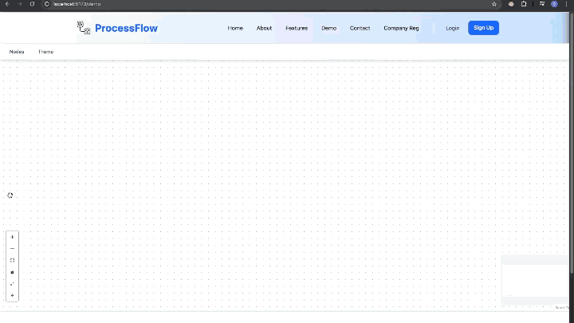

<h1 align="center">Manufacturing Execution System (MES)</h1>

A full-stack, Industry 4.0–oriented **Manufacturing Execution System** built using the **MERN stack**, designed to digitally orchestrate shop-floor workflows with real-time collaboration, visual process modeling, and production analytics.

> This system acts as the **Level-3 (MOM layer)** bridge between ERP systems and real-time shop-floor operations.

&url=https://github.com/SidusSolvere/manufacturing-execution-system)

 </img>
---

##  Project Overview

The Manufacturing Execution System (MES) digitizes and optimizes manufacturing operations by replacing siloed, manual processes with a **real-time, collaborative, visual workflow platform**.

It enables organizations to:

* Visually design manufacturing workflows
* Execute and track production orders
* Monitor machines and operators in real time
* Detect production bottlenecks using analytics
* Enforce strict multi-tenant data isolation with RBAC

---

##  Key Objectives

* Eliminate information silos on the shop floor
* Enable real-time collaboration using WebSockets
* Improve traceability from raw material → finished product
* Provide data-driven insights into production bottlenecks
* Support multi-company deployments securely

---

## Core Features

### Visual Workflow Orchestration

* Node-based drag-and-drop editor
* Validated production flows
* Automatic layout optimization
* Real-time multi-user synchronization

---

### Multi-Tenant Organization Management

* Single deployment → multiple companies
* Strict data isolation
* Hierarchical Role-Based Access Control (RBAC)

**Roles Supported**

* Super Admin
* Company Admin
* Lead Automation Engineer
* Production Supervisor
* Machine Operator

---

## Demo Video

 
 [**System Walkthrough & Demo**](https://youtu.be/pIA9rwmuRJs)

---
## Special Thanks

- [XY flow team](https://reactflow.dev/) for making the awesome library

---

## Follow us 
**Sid**

**Aryan**

**Prashant**

